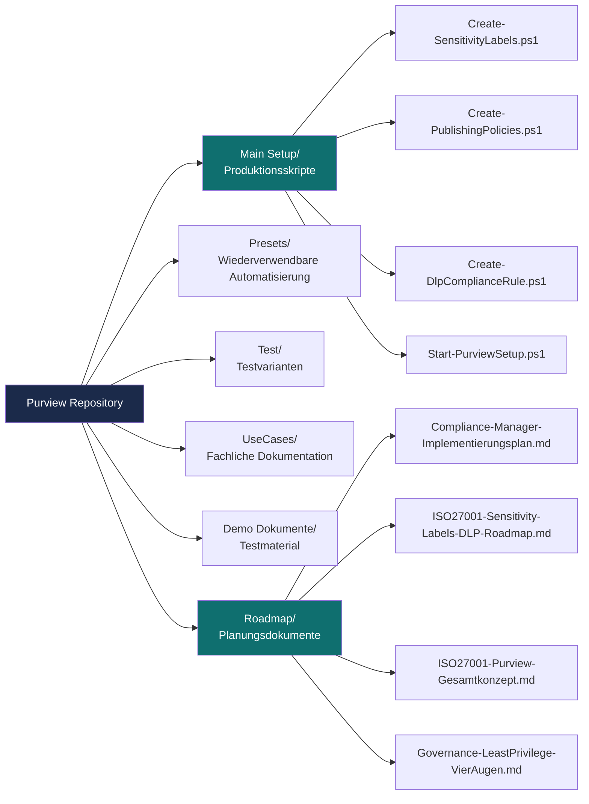
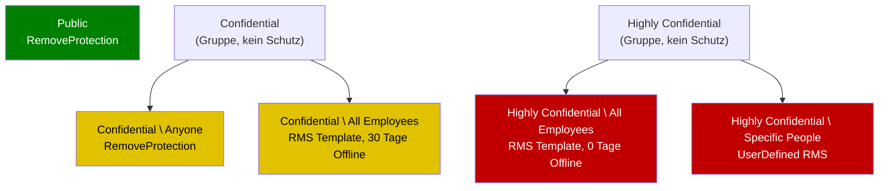
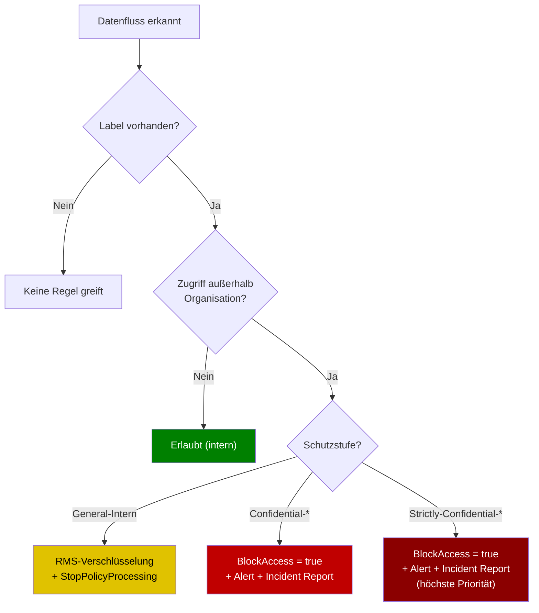
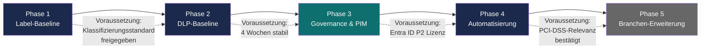
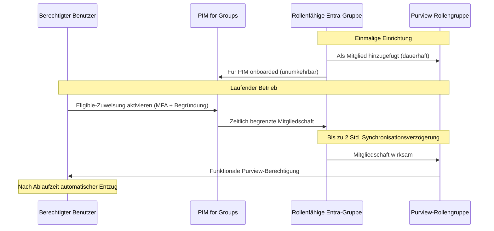
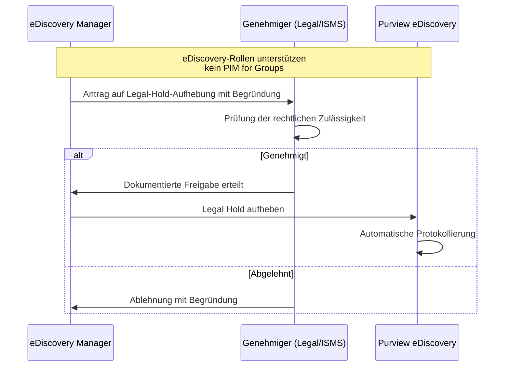
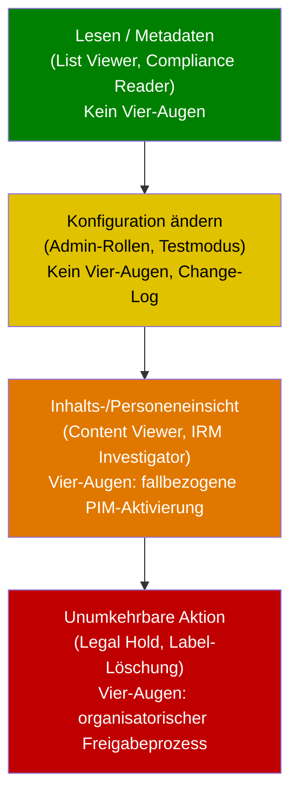
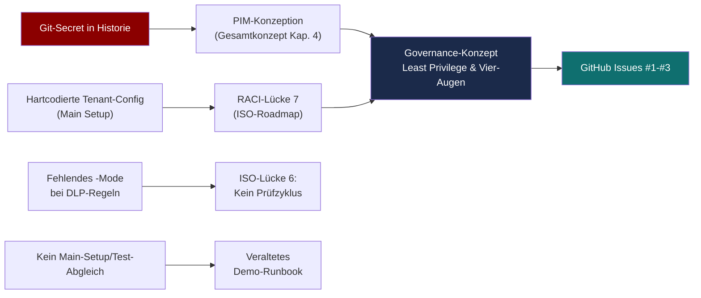

# Visualisierungen: Repository-Übersicht in Diagrammen

> **Hinweis:** Alle Diagramme in diesem Dokument sind als Mermaid-Code eingebettet und werden von GitHub direkt im Browser gerendert — kein externes Tool nötig. Dieses Dokument bezieht sich auf die gesamte Struktur des Repositories: `Main Setup/`, `Presets/`, `Test/`, `UseCases/`, `Roadmap/`.

## 1. Repository-Gesamtstruktur

## 2. Sensitivity-Label-Hierarchie (aus `Create-SensitivityLabels.ps1` / Baseline-Konzept)

## 3. DLP-Regel-Entscheidungslogik (Kernprinzip aus `Create-DlpComplianceRule.ps1`)

## 4. Fünfstufige Einführungsroadmap (aus `ISO27001-Purview-Gesamtkonzept.md`, Abschnitt 6)

## 5. PIM-Konzeption für Purview-Rollengruppen (aus Gesamtkonzept, Abschnitt 4.3)

## 6. Vier-Augen-Workflow: eDiscovery Legal Hold (Sonderfall, kein PIM möglich)

## 7. Least-Privilege-Eskalationsstufen je Purview-Lösung (aus `Governance-LeastPrivilege-VierAugen.md`)

## 8. Korrelationsmap: Zusammenhänge zwischen den Review-Befunden

## 9. Zuordnung Diagramm ↔ Repo-Dokument

| Diagramm | Referenziertes Dokument |
|---|---|
| 1. Repository-Gesamtstruktur | Gesamtes Repository |
| 2. Label-Hierarchie | `Main Setup/Create-SensitivityLabels.ps1`, `Roadmap/ISO27001-Purview-Gesamtkonzept.md` Abschnitt 2 |
| 3. DLP-Entscheidungslogik | `Main Setup/Create-DlpComplianceRule.ps1` |
| 4. Einführungsroadmap | `Roadmap/ISO27001-Purview-Gesamtkonzept.md` Abschnitt 6 |
| 5. PIM-Sequenzdiagramm | `Roadmap/ISO27001-Purview-Gesamtkonzept.md` Abschnitt 4.3 |
| 6. eDiscovery-Vier-Augen | `Roadmap/Governance-LeastPrivilege-VierAugen.md` Abschnitt 5 |
| 7. Least-Privilege-Eskalation | `Roadmap/Governance-LeastPrivilege-VierAugen.md` Abschnitt 8 |
| 8. Korrelationsmap | Security-Review und Korrelationsanalyse vom 29.08.2026 |

Dieses Dokument wird nicht automatisch aktualisiert. Bei strukturellen Änderungen an Skripten, Labelschema oder Rollenmodell sollten die betroffenen Diagramme entsprechend angepasst werden.
