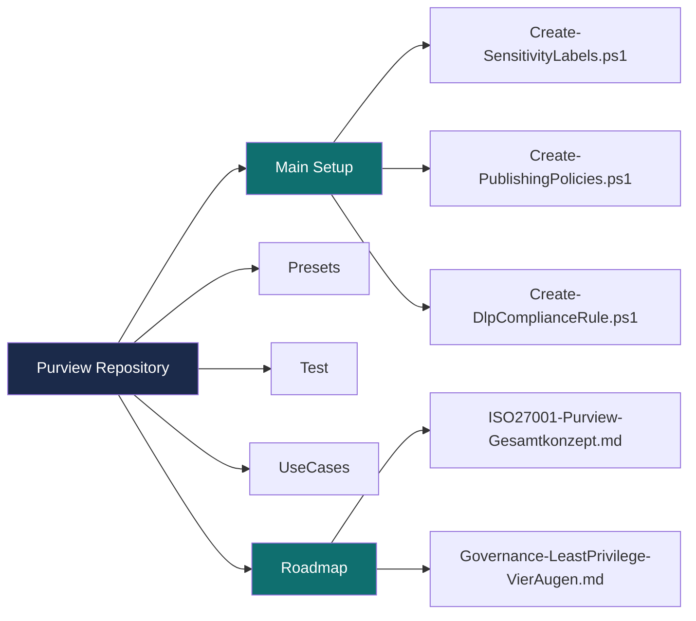
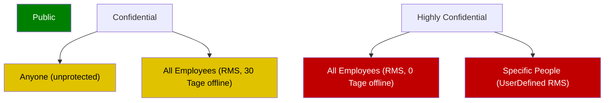
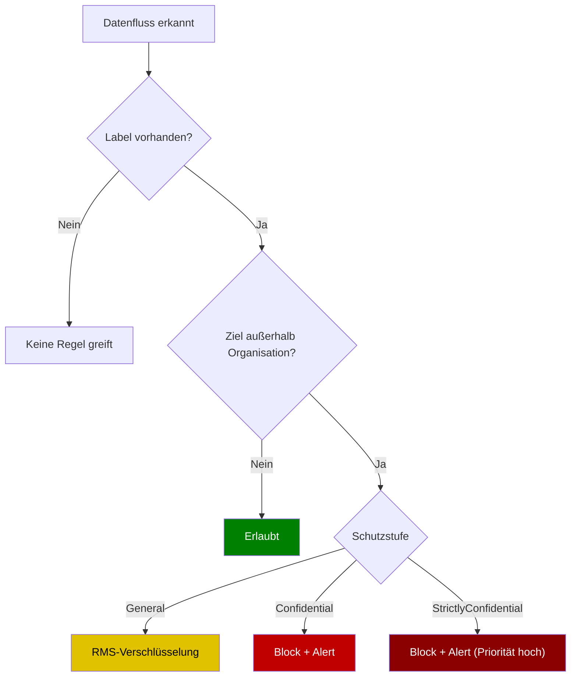
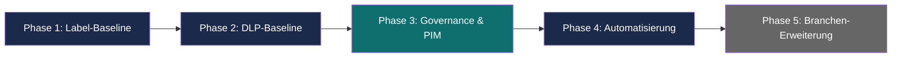
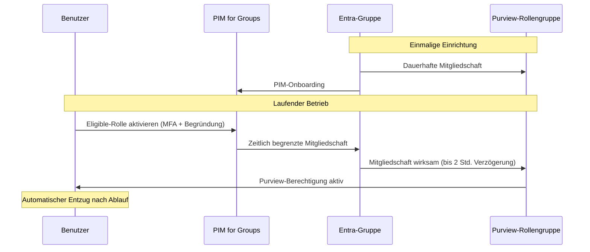
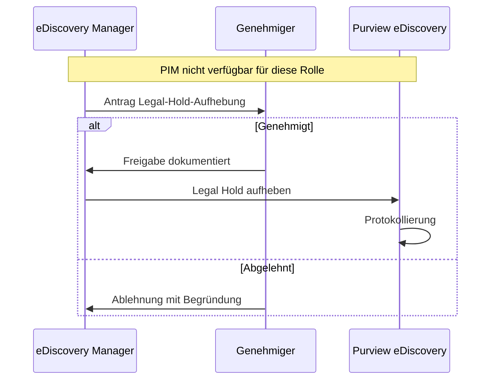
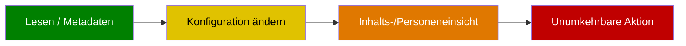
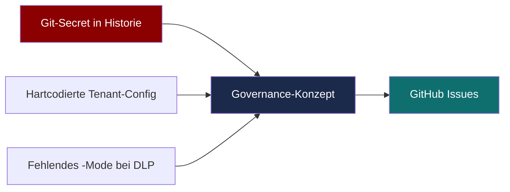
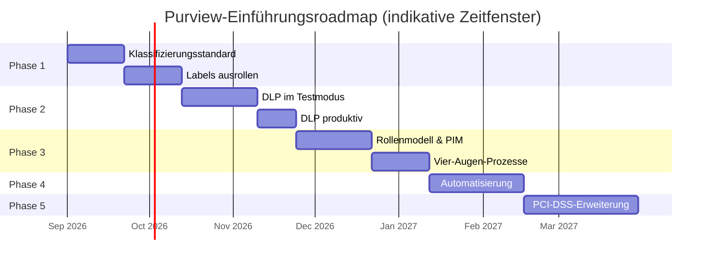
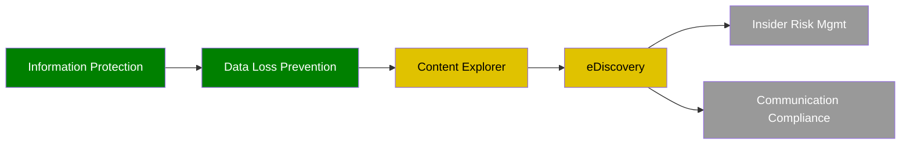

# Visualisierungen: Repository-Übersicht in Diagrammen

> **Hinweis:** Alle Diagramme in diesem Dokument sind als Mermaid-Code eingebettet und werden von GitHub direkt im Browser gerendert — kein externes Tool nötig. Knoten-Text wurde bewusst kurz gehalten; ausführliche Begründungen stehen als Fließtext unter dem jeweiligen Diagramm, nicht im Diagramm selbst.

## 1. Repository-Gesamtstruktur

## 2. Sensitivity-Label-Hierarchie

Public wird ungeschützt veröffentlicht. Confidential besitzt zwei Sublabels mit unterschiedlicher Offline-Gültigkeit. Highly Confidential erzwingt entweder ein festes RMS-Template ohne Offline-Zugriff oder eine benutzerdefinierte Freigabe an namentlich genannte Personen.

## 3. DLP-Regel-Entscheidungslogik

## 4. Fünfstufige Einführungsroadmap

Voraussetzungen zwischen den Phasen: Phase 1→2 erfordert einen freigegebenen Klassifizierungsstandard, Phase 2→3 erfordert vier Wochen stabilen DLP-Betrieb, Phase 3→4 erfordert eine Entra-ID-P2-Lizenz, Phase 4→5 erfordert eine bestätigte PCI-DSS-Relevanz.

## 5. PIM-Konzeption für Purview-Rollengruppen

## 6. Vier-Augen-Workflow: eDiscovery Legal Hold

## 7. Least-Privilege-Eskalationsstufen

| Stufe | Beispiele | Vier-Augen? |
|---|---|---|
| Lesen / Metadaten | List Viewer, Compliance Reader | Nein |
| Konfiguration ändern | Admin-Rollen, DLP-Testmodus | Nein, aber Change-Log-Pflicht |
| Inhalts-/Personeneinsicht | Content Viewer, IRM Investigator | Ja, fallbezogene PIM-Aktivierung |
| Unumkehrbare Aktion | Legal Hold, Label-Löschung | Ja, organisatorischer Freigabeprozess |

## 8. Korrelationsmap: Zusammenhänge zwischen Review-Befunden

Drei unabhängige Befunde aus dem Security-Review (Secret in der Git-Historie, hartcodierte Tenant-Konfiguration im produktiven Setup-Skript, fehlender Testmodus-Parameter bei DLP-Regeln) führten zur Erstellung des Governance-Konzepts und der daraus abgeleiteten GitHub-Issues.

## 9. Gantt-Chart der Einführungsroadmap

Die Zeitfenster sind indikativ und noch nicht mit dem Projektteam terminiert.

## 10. RACI-Matrix für die Datenklassifizierung

Eine RACI-Zuordnung ist inhaltlich eine Matrix und wird deshalb als Tabelle statt als Graph dargestellt — das vermeidet unnötige Linienkreuzungen und ist eindeutig lesbar.

| Aufgabe | Data Owner | Data Steward | ISMS-Verantwortlicher | Endbenutzer |
|---|---|---|---|---|
| Klassifizierungsstandard definieren | A | C | R | — |
| Label am Dokument anwenden | A | I | — | R |
| Fehlklassifizierung korrigieren | A | R | — | I |
| Label-Schema überarbeiten | C | R | A | — |
| Einhaltung stichprobenhaft prüfen | I | — | R/A | — |

**Legende:** R = Responsible (führt aus), A = Accountable (verantwortlich), C = Consulted (konsultiert), I = Informed (informiert).

Diese Matrix schließt die in `ISO27001-Sensitivity-Labels-DLP-Roadmap.md` beschriebene Lücke 7 (fehlende RACI für Klassifizierung).

## 11. Reifegradlandkarte aller Purview-Lösungen

Grün = aktiv produktiv (Information Protection, DLP). Gelb = Rollenmodell existiert, Einführung in Phase 3 geplant (Content Explorer, eDiscovery). Grau = noch nicht eingeführt, Priorität 3 laut Implementierungsplan (Insider Risk Management, Communication Compliance).

## 12. Zuordnung Diagramm ↔ Repo-Dokument

| Diagramm | Referenziertes Dokument |
|---|---|
| 1. Repository-Gesamtstruktur | Gesamtes Repository |
| 2. Label-Hierarchie | `Main Setup/Create-SensitivityLabels.ps1` |
| 3. DLP-Entscheidungslogik | `Main Setup/Create-DlpComplianceRule.ps1` |
| 4. Einführungsroadmap | `Roadmap/ISO27001-Purview-Gesamtkonzept.md` Abschnitt 6 |
| 5. PIM-Sequenzdiagramm | `Roadmap/ISO27001-Purview-Gesamtkonzept.md` Abschnitt 4.3 |
| 6. eDiscovery-Vier-Augen | `Roadmap/Governance-LeastPrivilege-VierAugen.md` Abschnitt 5 |
| 7. Least-Privilege-Eskalation | `Roadmap/Governance-LeastPrivilege-VierAugen.md` Abschnitt 8 |
| 8. Korrelationsmap | Security-Review vom 29.08.2026 |
| 9. Gantt-Chart Roadmap | `Roadmap/ISO27001-Purview-Gesamtkonzept.md` Abschnitt 6 |
| 10. RACI-Matrix | `Roadmap/ISO27001-Sensitivity-Labels-DLP-Roadmap.md`, Lücke 7 |
| 11. Reifegradlandkarte | `Roadmap/Governance-LeastPrivilege-VierAugen.md` Abschnitte 4-5 |

Dieses Dokument wird nicht automatisch aktualisiert. Bei strukturellen Änderungen an Skripten, Labelschema oder Rollenmodell sollten die betroffenen Diagramme entsprechend angepasst werden.
