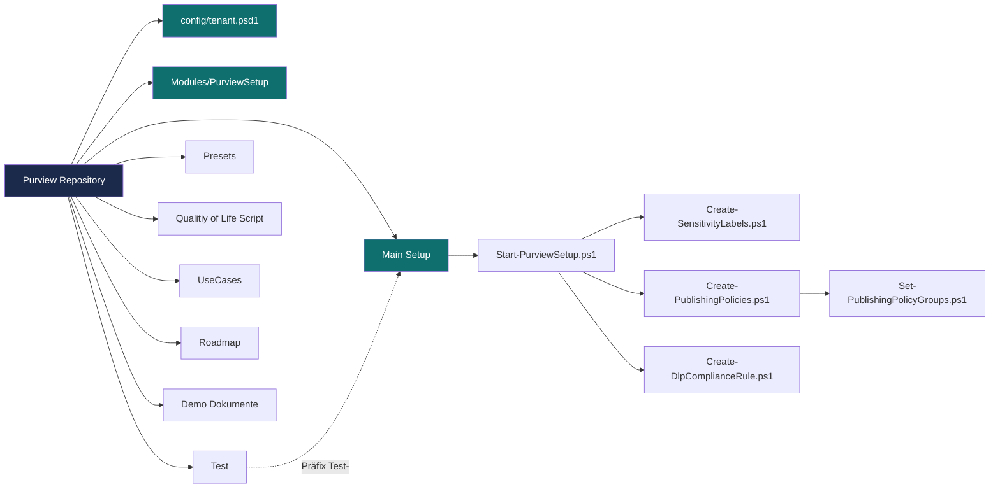
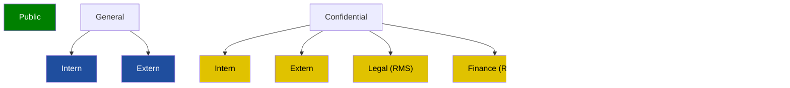
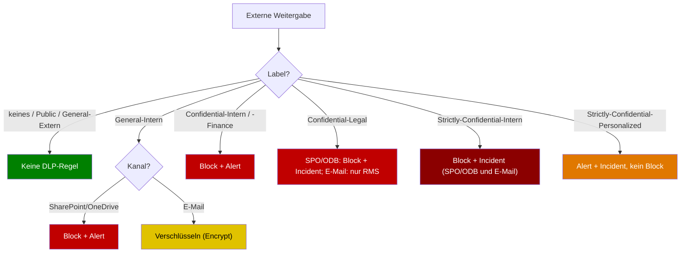
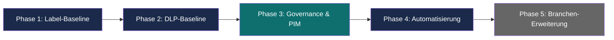
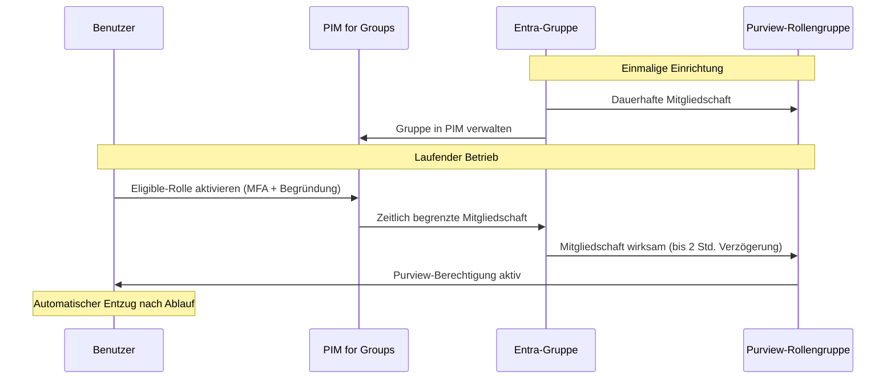
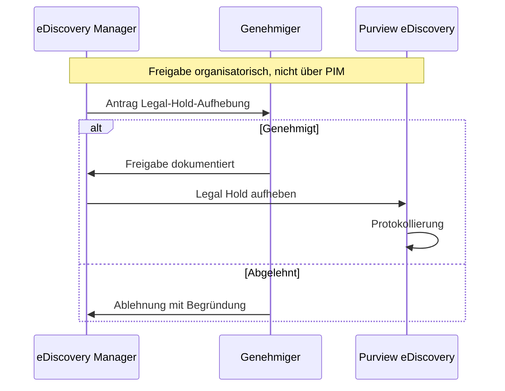
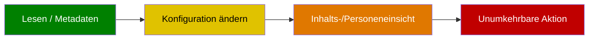
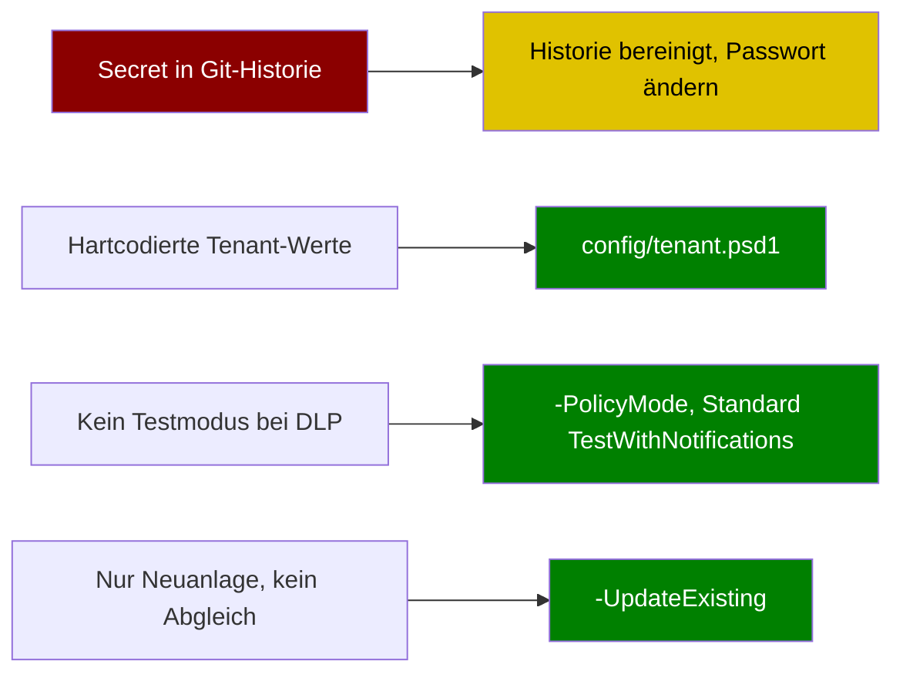
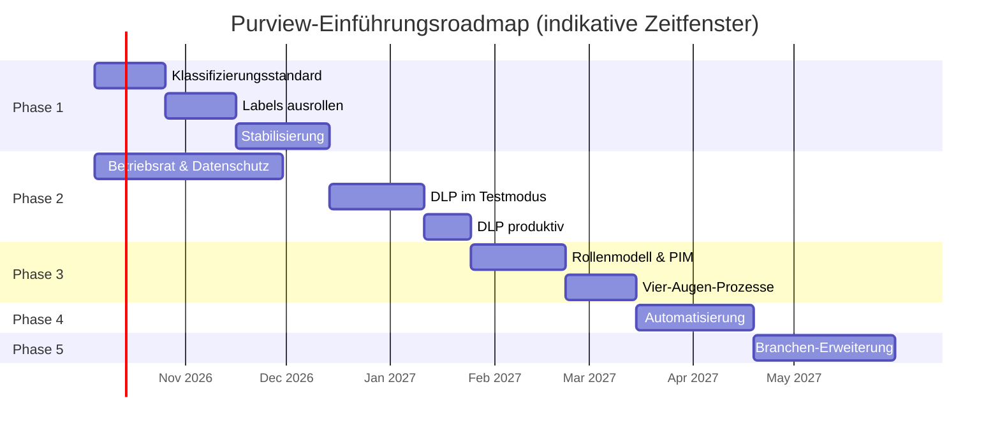
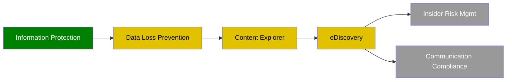

# Visualisierungen: Repository-Übersicht in Diagrammen

| | |
|---|---|
| **Status** | Arbeitsstand |
| **Stand** | 2026-09-27 |

> **Hinweis:** Alle Diagramme sind als Mermaid-Code eingebettet und werden von GitHub direkt im Browser gerendert. Knoten-Text ist bewusst kurz; Begründungen stehen im Fließtext darunter. Diagramme 2 und 3 zeigen die **umgesetzte** Konfiguration (`UseCases/UseCaseKontext.md`), Diagramme 4, 5 und 9 die **Zielarchitektur** (`ISO27001-Purview-Gesamtkonzept.md`).

## 1. Repository-Gesamtstruktur

```mermaid
flowchart LR
    Root["Purview Repository"] --> CFG["config/tenant.psd1"]
    Root --> MOD["Modules/PurviewSetup"]
    Root --> MS["Main Setup"]
    Root --> TS["Test"]
    Root --> PS["Presets"]
    Root --> QL["Qualitiy of Life Script"]
    Root --> UC["UseCases"]
    Root --> RM["Roadmap"]
    Root --> DD["Demo Dokumente"]

    MS --> MS0["Start-PurviewSetup.ps1"]
    MS0 --> MS1["Create-SensitivityLabels.ps1"]
    MS0 --> MS2["Create-PublishingPolicies.ps1"]
    MS2 --> MS2a["Set-PublishingPolicyGroups.ps1"]
    MS0 --> MS3["Create-DlpComplianceRule.ps1"]
    TS -. "Präfix Test-" .-> MS

    style Root fill:#1b2a4a,color:#fff
    style MS fill:#0f6f6f,color:#fff
    style CFG fill:#0f6f6f,color:#fff
    style MOD fill:#0f6f6f,color:#fff
```

Alle Skripte in `Main Setup/` lesen tenant-spezifische Werte aus `config/tenant.psd1` und nutzen das Modul `Modules/PurviewSetup`. Die Skripte in `Test/` rufen `Main Setup/` mit Präfixen auf.

## 2. Umgesetzte Sensitivity-Label-Hierarchie

```mermaid
graph TD
    Public["Public"]
    Gen["General"]
    Conf["Confidential"]
    SC["Strictly Confidential"]

    Gen --> GI["Intern"]
    Gen --> GE["Extern"]
    Conf --> CI["Intern"]
    Conf --> CE["Extern"]
    Conf --> CL["Legal (RMS)"]
    Conf --> CF["Finance (RMS)"]
    SC --> SI["Intern (RMS)"]
    SC --> SP["Personalized (Benutzer)"]

    style Public fill:#008000,color:#fff
    style GI fill:#1f4e9e,color:#fff
    style GE fill:#1f4e9e,color:#fff
    style CI fill:#e0c200,color:#000
    style CE fill:#e0c200,color:#000
    style CL fill:#e0c200,color:#000
    style CF fill:#e0c200,color:#000
    style SI fill:#c00000,color:#fff
    style SP fill:#c00000,color:#fff
```

RMS-Schutz haben nur Legal (Legal Team Co-Owner, Leadership Co-Author), Finance (Finance Team Co-Owner, Leadership Co-Author) und Strictly-Confidential-Intern (Leadership Co-Owner); Personalized lässt den Benutzer Empfänger und Rechte wählen. Legal, Finance und Strictly-Confidential-Intern sind nur für die jeweiligen Gruppen veröffentlicht. Die Ziel-Baseline im Gesamtkonzept (Public/Internal/Confidential/Highly Confidential) weicht davon bewusst ab.

## 3. Umgesetzte DLP-Entscheidungslogik (externe Weitergabe)

```mermaid
flowchart TD
    Start["Externe Weitergabe"] --> Label{"Label?"}
    Label -- "keines / Public / General-Extern" --> Allow["Keine DLP-Regel"]
    Label -- "General-Intern" --> GIch{"Kanal?"}
    GIch -- "SharePoint/OneDrive" --> Block1["Block + Alert"]
    GIch -- "E-Mail" --> Enc["Verschlüsseln (Encrypt)"]
    Label -- "Confidential-Intern / -Finance" --> Block2["Block + Alert"]
    Label -- "Confidential-Legal" --> Block3["SPO/ODB: Block + Incident; E-Mail: nur RMS"]
    Label -- "Strictly-Confidential-Intern" --> Block4["Block + Incident (SPO/ODB und E-Mail)"]
    Label -- "Strictly-Confidential-Personalized" --> Alert["Alert + Incident, kein Block"]

    style Block1 fill:#c00000,color:#fff
    style Block2 fill:#c00000,color:#fff
    style Block3 fill:#c00000,color:#fff
    style Block4 fill:#8b0000,color:#fff
    style Enc fill:#e0c200,color:#000
    style Alert fill:#e07800,color:#fff
    style Allow fill:#008000,color:#fff
```

Confidential-Finance wird per E-Mail nicht durch DLP blockiert (nur RMS-Schutz); im Diagramm ist der SharePoint/OneDrive-Fall dargestellt. Nicht dargestellt: Proton-Regel (zusätzlicher Alert), Copilot (Ausschluss sensibler Inhalte) und Endpoint (Upload-Sperre in eingeschränkte Cloud-/KI-Apps). Alle Blockierungen wirken erst, wenn die DLP-Policies auf `Enable` stehen.

## 4. Fünfstufige Einführungsroadmap (Zielarchitektur)

```mermaid
flowchart LR
    P1["Phase 1: Label-Baseline"] --> P2["Phase 2: DLP-Baseline"]
    P2 --> P3["Phase 3: Governance & PIM"]
    P3 --> P4["Phase 4: Automatisierung"]
    P4 --> P5["Phase 5: Branchen-Erweiterung"]

    style P1 fill:#1b2a4a,color:#fff
    style P2 fill:#1b2a4a,color:#fff
    style P3 fill:#0f6f6f,color:#fff
    style P4 fill:#1b2a4a,color:#fff
    style P5 fill:#666,color:#fff
```

Voraussetzungen laut Gesamtkonzept, Abschnitt 6: Phase 1 erfordert einen freigegebenen Klassifizierungsstandard; Phase 2 mindestens vier Wochen stabilen Betrieb von Phase 1 sowie Betriebsvereinbarung und Datenschutzprüfung; Phase 3 eine Entra-ID-P2-Lizenz; Phase 4 stabile und auditierte Phasen 1–3; Phase 5 eine bestätigte regulatorische Anwendbarkeit (z. B. PCI-DSS).

## 5. PIM-Konzeption für Purview-Rollengruppen

```mermaid
sequenceDiagram
    participant U as Benutzer
    participant PIM as PIM for Groups
    participant Grp as Entra-Gruppe
    participant Pur as Purview-Rollengruppe

    Note over Grp,Pur: Einmalige Einrichtung
    Grp->>Pur: Dauerhafte Mitgliedschaft
    Grp->>PIM: Gruppe in PIM verwalten

    Note over U,Pur: Laufender Betrieb
    U->>PIM: Eligible-Rolle aktivieren (MFA + Begründung)
    PIM->>Grp: Zeitlich begrenzte Mitgliedschaft
    Grp->>Pur: Mitgliedschaft wirksam (bis 2 Std. Verzögerung)
    Pur->>U: Purview-Berechtigung aktiv
    Note over U: Automatischer Entzug nach Ablauf
```

## 6. Vier-Augen-Workflow: eDiscovery Legal Hold

```mermaid
sequenceDiagram
    participant M as eDiscovery Manager
    participant G as Genehmiger
    participant P as Purview eDiscovery

    Note over M,P: Freigabe organisatorisch, nicht über PIM
    M->>G: Antrag Legal-Hold-Aufhebung
    alt Genehmigt
        G->>M: Freigabe dokumentiert
        M->>P: Legal Hold aufheben
        P->>P: Protokollierung
    else Abgelehnt
        G->>M: Ablehnung mit Begründung
    end
```

## 7. Least-Privilege-Eskalationsstufen

```mermaid
flowchart LR
    Read["Lesen / Metadaten"] --> Config["Konfiguration ändern"]
    Config --> Content["Inhalts-/Personeneinsicht"]
    Content --> Critical["Unumkehrbare Aktion"]

    style Read fill:#008000,color:#fff
    style Config fill:#e0c200,color:#000
    style Content fill:#e07800,color:#fff
    style Critical fill:#c00000,color:#fff
```

| Stufe | Beispiele | Vier-Augen? |
|---|---|---|
| Lesen / Metadaten | List Viewer, Information Protection Readers, Global Reader | Nein |
| Konfiguration ändern | Admin-Rollen, DLP im Testmodus | Nein, aber Change-Log-Pflicht |
| Inhalts-/Personeneinsicht | Content Viewer, IRM Investigator | Ja, PIM-Aktivierung mit Genehmigung |
| Unumkehrbare Aktion | Legal Hold, Label-Löschung, DLP scharf schalten | Ja, organisatorischer Freigabeprozess |

## 8. Umsetzungsstand der Review-Befunde

```mermaid
flowchart LR
    Secret["Secret in Git-Historie"] --> Fix1["Historie bereinigt, Passwort ändern"]
    Hardcode["Hartcodierte Tenant-Werte"] --> Fix2["config/tenant.psd1"]
    Mode["Kein Testmodus bei DLP"] --> Fix3["-PolicyMode, Standard TestWithNotifications"]
    Drift["Nur Neuanlage, kein Abgleich"] --> Fix4["-UpdateExisting"]

    style Secret fill:#8b0000,color:#fff
    style Fix1 fill:#e0c200,color:#000
    style Fix2 fill:#008000,color:#fff
    style Fix3 fill:#008000,color:#fff
    style Fix4 fill:#008000,color:#fff
```

Die Bereinigung der Git-Historie wird erst mit dem Force-Push auf `main` wirksam; das offengelegte Kennwort muss unabhängig davon geändert werden. Details: `CHANGELOG.md`.

## 9. Gantt-Chart der Einführungsroadmap (Zielarchitektur)

```mermaid
gantt
    dateFormat  YYYY-MM-DD
    axisFormat  %b %Y
    title Purview-Einführungsroadmap (indikative Zeitfenster)

    section Phase 1
    Klassifizierungsstandard      :p1a, 2026-10-05, 3w
    Labels ausrollen              :p1b, after p1a, 3w
    Stabilisierung                :p1c, after p1b, 4w

    section Phase 2
    Betriebsrat & Datenschutz     :p2z, 2026-10-05, 8w
    DLP im Testmodus              :p2a, after p1c, 4w
    DLP produktiv                 :p2b, after p2a, 2w

    section Phase 3
    Rollenmodell & PIM            :p3a, after p2b, 4w
    Vier-Augen-Prozesse           :p3b, after p3a, 3w

    section Phase 4
    Automatisierung               :p4a, after p3b, 5w

    section Phase 5
    Branchen-Erweiterung          :p5a, after p4a, 6w
```

Die Zeitfenster sind indikativ und noch nicht mit dem Projektteam terminiert.

## 10. RACI-Matrix für die Datenklassifizierung

Rollenbezeichnungen wie im Gesamtkonzept, Abschnitt 4.1 und 5.2.

| Aufgabe | Information Owner | Purview Compliance Architect | Purview Operator | ISMS-Verantwortlicher | Endbenutzer |
|---|---|---|---|---|---|
| Klassifizierungsstandard definieren | R | C | I | A | — |
| Label am Dokument anwenden | A | — | — | — | R |
| Fehlklassifizierung korrigieren | A | I | R | — | I |
| Label-Schema überarbeiten | C | R | C | A | — |
| Einhaltung stichprobenhaft prüfen | I | C | — | A/R | — |

**Legende:** R = Responsible (führt aus), A = Accountable (verantwortlich), C = Consulted (konsultiert), I = Informed (informiert).

## 11. Reifegradlandkarte aller Purview-Lösungen

```mermaid
flowchart LR
    IP["Information Protection"] --> DLP["Data Loss Prevention"]
    DLP --> CE["Content Explorer"]
    CE --> ED["eDiscovery"]
    ED --> IRM["Insider Risk Mgmt"]
    ED --> CC["Communication Compliance"]

    style IP fill:#008000,color:#fff
    style DLP fill:#e0c200,color:#000
    style CE fill:#e0c200,color:#000
    style ED fill:#e0c200,color:#000
    style IRM fill:#999,color:#fff
    style CC fill:#999,color:#fff
```

Grün = produktiv (Information Protection). Gelb = eingeführt bzw. geplant: DLP ist konfiguriert, neue Policies laufen zunächst im Testmodus; Content Explorer und eDiscovery haben ein Rollenmodell, Einführung in Phase 3. Grau = noch nicht eingeführt (Insider Risk Management, Communication Compliance; Voraussetzung Betriebsvereinbarung).

## 12. Zuordnung Diagramm ↔ Repo-Dokument

| Diagramm | Referenziertes Dokument |
|---|---|
| 1. Repository-Gesamtstruktur | Gesamtes Repository, `README.md` |
| 2. Label-Hierarchie | `Main Setup/Create-SensitivityLabels.ps1`, `UseCases/UseCaseKontext.md` Abschnitt 3 |
| 3. DLP-Entscheidungslogik | `Main Setup/Create-DlpComplianceRule.ps1`, `UseCases/UseCaseKontext.md` Abschnitt 5 |
| 4. Einführungsroadmap | `Roadmap/ISO27001-Purview-Gesamtkonzept.md` Abschnitt 6 |
| 5. PIM-Sequenzdiagramm | `Roadmap/ISO27001-Purview-Gesamtkonzept.md` Abschnitt 4.3 |
| 6. eDiscovery-Vier-Augen | `Roadmap/Governance-LeastPrivilege-VierAugen.md` Abschnitt 5 |
| 7. Least-Privilege-Eskalation | `Roadmap/Governance-LeastPrivilege-VierAugen.md` Abschnitt 8 |
| 8. Umsetzungsstand Review-Befunde | `CHANGELOG.md` |
| 9. Gantt-Chart Roadmap | `Roadmap/ISO27001-Purview-Gesamtkonzept.md` Abschnitte 6 und 8 |
| 10. RACI-Matrix | `Roadmap/ISO27001-Purview-Gesamtkonzept.md` Abschnitte 4.1 und 5.2 |
| 11. Reifegradlandkarte | `Roadmap/Governance-LeastPrivilege-VierAugen.md` Abschnitte 4–7 |

Dieses Dokument wird nicht automatisch aktualisiert. Bei Änderungen an Skripten, Labelschema oder Rollenmodell die betroffenen Diagramme anpassen.
